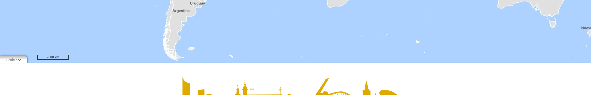

<p align="center">
  
</p>
<h1 align="center"><strong>API IDEE</strong> <small>🔌 IDEE.plugin.Mapfooter</small></h1>

## Descripción

Plugin para la generación de un pie de página HTML colapsable bajo el mapa.



## Dependencias

Para que el plugin funcione correctamente es necesario importar las siguientes dependencias en el documento html:
Para uso de implementación OpenLayers:
- **mapfooter.ol.min.js**
- **mapfooter.ol.min.css**

Para uso de implementación Cesium:
- **mapfooter.cesium.min.js**
- **mapfooter.cesium.min.css**

```html
 <link href="https://componentes.idee.es/api-idee/plugins/mapfooter/mapfooter.ol.min.css" rel="stylesheet" />
 <script type="text/javascript" src="https://componentes.idee.es/api-idee/plugins/mapfooter/mapfooter.ol.min.js"></script>
```

# Uso del histórico de versiones

Existe un histórico de versiones de todos los plugins de API-IDEE en [api-idee-legacy](https://github.com/Desarrollos-IDEE/API-IDEE/tree/master/api-idee-legacy/plugins) para hacer uso de versiones anteriores.
Ejemplo:
```html
 <link href="https://componentes.idee.es/api-idee/plugins/mapfooter/mapfooter-2.0.0.ol.min.css" rel="stylesheet" />
 <script type="text/javascript" src="https://componentes.idee.es/api-idee/plugins/mapfooter/mapfooter-2.0.0.ol.min.js"></script>
```

## Parámetros

El constructor se inicializa con un JSON con los siguientes atributos:

- **position**: Posición donde se muestra el plugin (por defecto `down`).
  - `left`, `right`
  - `center-bottom-left`, `center-bottom-right`
  - `center-top-left`, `center-top-right`
  - `down`
- **collapsed**: Si el pie aparece colapsado al inicio (por defecto `true`). Compatibilidad legacy: `open: true` equivale a `collapsed: false`.
- **collapsible**: Si el panel puede abrirse y cerrarse (por defecto `true`).
- **order**: Orden del panel respecto a otros controles/plugins.
- **tooltip**: Texto del tooltip del botón.
- **htmlCode**: Código HTML del pie de página.
- **cssList**: Lista de URLs CSS (array o string separado por comas) que se inyectan en el visor.

# API-REST

```javascript
URL_API?mapfooter=position*collapsed*order*tooltip*collapsible
```

`htmlCode` y `cssList` deben enviarse mediante **base64** (demasiado largos para el separador `*`).

<table>
    <tr>
        <th>Parámetros</th>
        <th>Opciones/Descripción</th>
        <th>Disponibilidad</th>
    </tr>
    <tr>
        <td>position</td>
        <td>left, right, down, center-top-left, center-top-right, center-bottom-left, center-bottom-right</td>
        <td>Base64 ✔️ | Separador ✔️</td>
    </tr>
    <tr>
        <td>collapsed</td>
        <td>true / false</td>
        <td>Base64 ✔️ | Separador ✔️</td>
    </tr>
    <tr>
        <td>order</td>
        <td>número</td>
        <td>Base64 ✔️ | Separador ✔️</td>
    </tr>
    <tr>
        <td>tooltip</td>
        <td>texto</td>
        <td>Base64 ✔️ | Separador ✔️</td>
    </tr>
    <tr>
        <td>collapsible</td>
        <td>true / false</td>
        <td>Base64 ✔️ | Separador ✔️</td>
    </tr>
    <tr>
        <td>htmlCode</td>
        <td>HTML del pie</td>
        <td>Base64 ✔️</td>
    </tr>
    <tr>
        <td>cssList</td>
        <td>URLs CSS</td>
        <td>Base64 ✔️</td>
    </tr>
</table>

### Ejemplos de uso API-REST
```
https://componentes.idee.es/api-idee?mapfooter=down*false*0*Pie%20de%20página*true
```

### Ejemplo de uso API-REST en base64

```javascript
IDEE.utils.encodeBase64(obj_params);
```

Ejemplo de constructor:
```javascript
{
  position: 'down',
  collapsed: false,
  htmlCode: '<p>mi pie de página</p>',
  cssList: [
    'https://centrodedescargas.cnig.es/CentroDescargas/css/estilos-css-cnig-2024.css',
  ],
}
```

## Ejemplos de uso

```javascript
const map = IDEE.map({
  container: 'map',
});

const mp = new IDEE.plugin.Mapfooter({
  position: 'down',
  collapsed: false,
  htmlCode: `<div class="col-12 col-m-12 displayInlineBlock txtCenter fontSize09em">
                <p class="marginBottom0">© Organismo Autónomo Centro Nacional de Información Geográfica (CNIG)</p>
                <div id="dirCnigPC" class="row paddingBottom1por">
                    <div class="col-12">
                    Calle General Ibáñez de Ibero, 3. 28003 - Madrid - España.
                    </div>
                    <div class="col-12">
                        NIF: ES Q2817024I  - NIPO: 798-20-071-1 - DOI: 10.7419/162.09.2020
                    </div>
                </div>
              </div>`,
  cssList: [
    'https://centrodedescargas.cnig.es/CentroDescargas/css/estilos-css-cnig-2024.css',
  ],
});

map.addPlugin(mp);
```

# 👨‍💻 Desarrollo

Para el stack de desarrollo de este componente se ha utilizado

* NodeJS Versión: 16 o superior
* NPM Versión: 8.19.4 o superior

## 📐 Configuración del stack de desarrollo / *Work setup*


### 🐑 Clonar el repositorio / *Cloning repository*

Para descargar el repositorio en otro equipo lo clonamos:

```bash
git clone [URL del repositorio]
```

### 1️⃣ Instalación de dependencias / *Install Dependencies*

```bash
npm i
```

### 2️⃣ Arranque del servidor de desarrollo / *Run Application*

```bash
npm run start:ol
npm run start:cesium
```

## 📂 Estructura del código / *Code scaffolding*

```any
/
├── src 📦                  # Código fuente
├── legacy 📁               # Histórico de versiones
├── task 📁                 # EndPoints
├── test 📁                 # Testing
├── webpack-config 📁       # Webpack configs
└── ...
```
## 📌 Metodologías y pautas de desarrollo / *Methodologies and Guidelines*

Metodologías y herramientas usadas en el proyecto para garantizar el Quality Assurance Code (QAC)

* ESLint
  * [NPM ESLint](https://www.npmjs.com/package/eslint) \
  * [NPM ESLint | Airbnb](https://www.npmjs.com/package/eslint-config-airbnb)

## ⛽️ Revisión e instalación de dependencias / *Review and Update Dependencies*

Para la revisión y actualización de las dependencias de los paquetes npm es necesario instalar de manera global el paquete/ módulo "npm-check-updates".

```bash
# Install and Run
$npm i -g npm-check-updates
$ncu
```

## Tabla de compatibilidad de versiones
[Consulta el api resourcePlugin](https://componentes.idee.es/api-idee/api/actions/resourcesPlugins?name=mapfooter)
